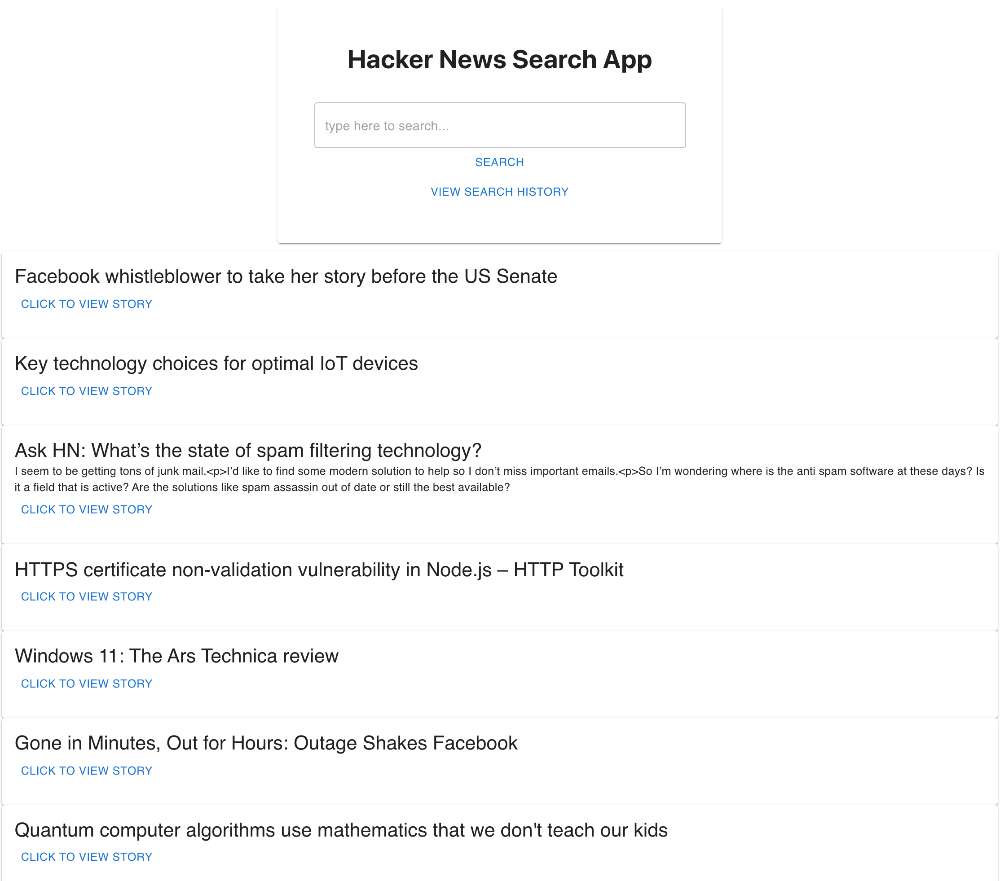

Readme

# Hacker News Search

## Description
This is a search application that searches the Hacker News API (https://hn.algolia.com/api) and returns search results to the user. It also has a search history that saves queries to localStorage and can be cleared using the Clear History button

## Technologies Used
- Create React App: https://www.npmjs.com/package/create-react-app
- Material UI: https://mui.com/getting-started/usage/
- Hacker News API: https://hn.algolia.com/api
- React Fetch Hook: https://www.npmjs.com/package/react-fetch-hook
- React Router Dom: https://www.npmjs.com/package/react-router-dom

## Usage
This application is deployed using GitHub Pages at https://suejinkim20.github.io/hacker-news-search/
It can also be run locally on your machine by cloning the repository, installing the dependencies (`npm i`), and starting up local host (`npm start`).

The application has the following appearance:

